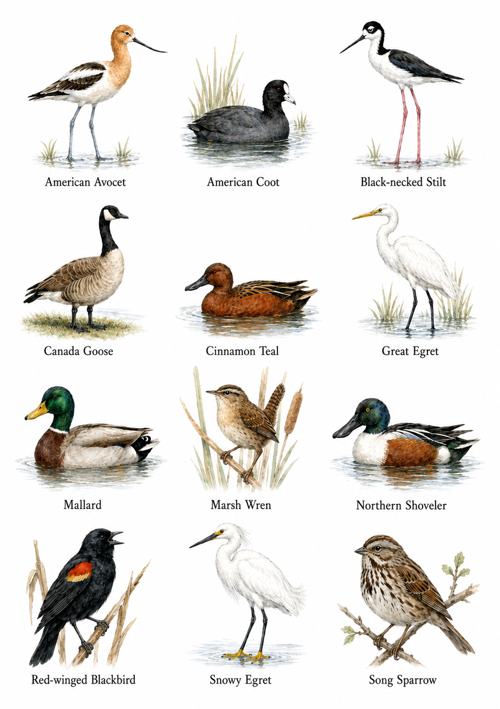

# Birdle: Marsh Madness

Drag a spotting scope across the marsh and identify all 12 hidden birds before the 60-second timer runs out.

## Birds

- American Avocet
- American Coot
- Black-necked Stilt
- Canada Goose
- Cinnamon Teal
- Great Egret
- Mallard
- Marsh Wren
- Northern Shoveler
- Red-winged Blackbird
- Snowy Egret
- Song Sparrow



## Run

```bash
npm run serve
```

Open `http://localhost:4173`.

## Android APK

Installable APK: [`releases/MarshMadness.apk`](releases/MarshMadness.apk)

Build from source: `npm run build:android`
